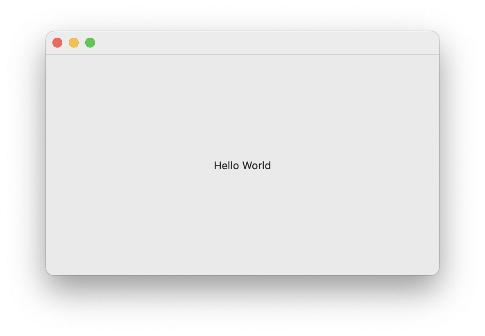
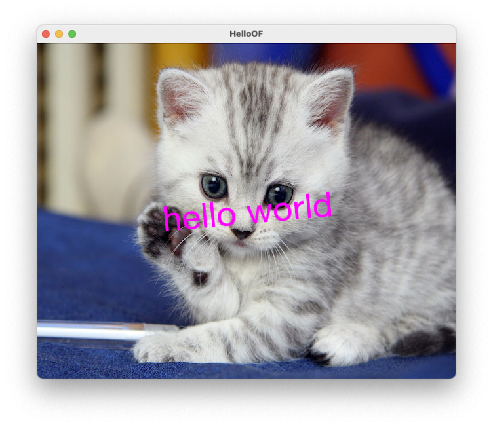
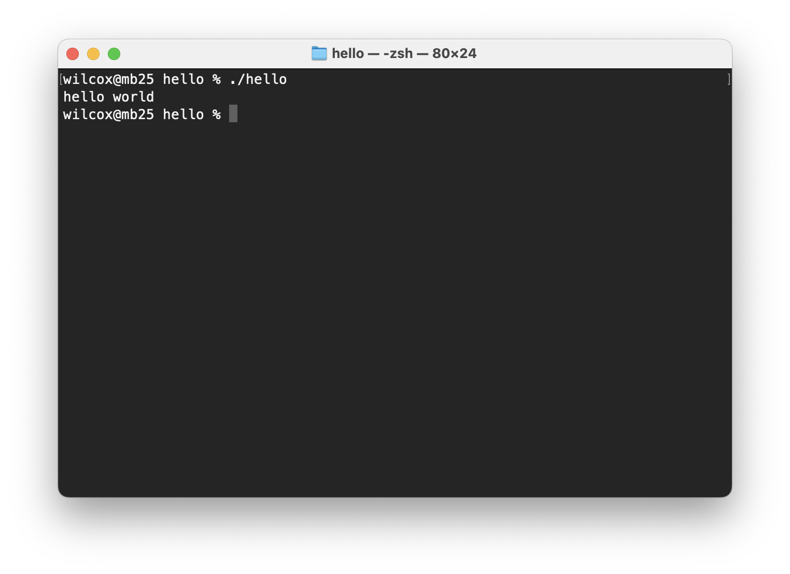

mac-dist-helper-examples
========================

Example projects for the [mac-dist-helper Makefile](https://github.com/zkmkarlsruhe/mac-dist-helper) which automates packaging macOS binaries for distribution

This code base has been developed by [ZKM | Hertz-Lab](https://zkm.de/en/about-the-zkm/organization/hertz-lab) as part of the project [»The Intelligent Museum«](#the-intelligent-museum).

Copyright (c) 2022 ZKM | Karlsruhe.  
Copyright (c) 2022 Dan Wilcox.

BSD Simplified License.

For information on usage and redistribution, and for a DISCLAIMER OF ALL
WARRANTIES, see the file, "LICENSE.txt," in this distribution.

Inspired by the [Hello World](https://github.com/pure-data/helloworld) Pure Data external using pd-lib-builder.

Quick Start
-----------

Clone this repository and it's dependencies:

```shell
git clone git@github.com:zkmkarlsruhe/mac-dist-helper-examples.git
git submodule update --init --recursive
```

Next, make sure all requirements are set up: [mac-dist-helper requirements](https://github.com/zkmkarlsruhe/mac-dist-helper#requirements)

Examples
--------

These are very basic instructions to build both the examples and distribution images. For details, see the [mac-dist-helper readme](https://github.com/zkmkarlsruhe/mac-dist-helper).

* **HelloWorld**: simple Cocoa app
* **HelloOF**: [openFrameworks](https://openframeworks.cc) macOS application
* **hello**: simple console program with a bundled dynamic library
* **hellopd**: [Pure Data](https://pure-data.info) C external library

To do a full clean on any example:

```shell
make clean dist-clean dist-clobber
```

### HelloWorld



This is a basic single-window Cocoa application.

In the Xcode project Signing & Capabilities settings:
* enable Automatically manage signing for Release and set the team
* enable Hardened Runtime, if not set

Next, set the codesign identity in `HelloWorld/Makefile`.

Create a signed & notarized distribution `dmg` disk image with:

```shell
cd HelloWorld
make app dist-dmg
```

### HelloOF



This is an [openFrameworks](https://openframeworks.cc) application with an external `data` folder.

The Xcode project file is not included so you will need to generate it using the OF ProjectGenerator which is included with the openFrameworks distribution.

To (re)generate the Xcode project:

1. Click the "Import" button in the ProjectGenerator
2. Navigate to the project's parent folder ie. "mac-dist-helper-examples", select the base folder for the example project ie. "HelloOF", and click the Open button
3. Click the "Update" button

Additionally, in the Xcode project Signing & Capabilities settings:
1. enable Automatically manage signing for Release and set the team
2. enable Hardened Runtime, if not set

Next, set the codesign identity in `HelloOF/Makefile`.

If everything went Ok, you should now be able to open the generated project and build/run the example.

Before building for distribution, make sure the OF lib itself is built by building the application once in Release mode with either Xcode or via `make` as `make app` doesn't do this. Then build the app export and notarized dmg with:

```shell
cd HelloOF
make
make app dist-dmg
```

### hello



This is a C console program which links to a custom dynamic library. Both binaries need to be signed "in place" then packaged and notarized.

Before starting, set the codesign identity in `hello/Makefile`.

When building, the following extra steps are performed for distribution:
* an Info.plist is embedded in each program executable using `-sectcreate TEXT`
* the dynamic lib loading paths are set to `@executable_path` using `install_name_tool`

Build for distribution with:

```shell
cd hello
make
make dist-dmg
```

### hellopd


This is a [Pure Data](https://pure-data.info) external library which is built using the [pd-lib-builder](https://github.com/pure-data/pd-lib-builder) makefile. The `pd_darwin` file (renamed dylib) needs to be signed then packaged and notarized. 

Before starting, set the codesign identity in `hellopd/Makefile`.

Build for distribution with:

```shell
cd hellopd
make
make dist-dmg
```

The Intelligent Museum
----------------------

An artistic-curatorial field of experimentation for deep learning and visitor participation

The [ZKM | Center for Art and Media](https://zkm.de/en) and the [Deutsches Museum Nuremberg](https://www.deutsches-museum.de/en/nuernberg/information/) cooperate with the goal of implementing an AI-supported exhibition. Together with researchers and international artists, new AI-based works of art will be realized during the next four years (2020-2023).  They will be embedded in the AI-supported exhibition in both houses. The Project „The Intelligent Museum” is funded by the Digital Culture Programme of the [Kulturstiftung des Bundes](https://www.kulturstiftung-des-bundes.de/en) (German Federal Cultural Foundation) and funded by the [Beauftragte der Bundesregierung für Kultur und Medien](https://www.bundesregierung.de/breg-de/bundesregierung/staatsministerin-fuer-kultur-und-medien) (Federal Government Commissioner for Culture and the Media).

As part of the project, digital curating will be critically examined using various approaches of digital art. Experimenting with new digital aesthetics and forms of expression enables new museum experiences and thus new ways of museum communication and visitor participation. The museum is transformed to a place of experience and critical exchange.


